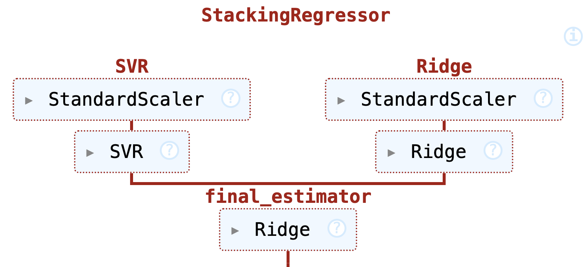

# Voice-Based Age Estimation

*An ensemble model combining SVR and Ridge Regression for robust age prediction from speech.*

---

## 📌 Overview
This project tackles **speaker age estimation** from voice recordings using acoustic, linguistic, and metadata features. The model leverages an ensemble of Support Vector Regression (SVR) and Ridge Regression to address dataset imbalances and improve generalization. Key highlights:
- **Ensemble Learning**: Combines SVR (non-linear patterns) and Ridge Regression (linear relationships).
- **Audio Feature Engineering**: Extracts pitch, energy, silence duration, and spectral descriptors using `librosa`.
- **Bias Mitigation**: Addresses age and ethnicity imbalances in the dataset.

**Performance**: Achieved **RMSE = 9.35** on the evaluation set.  

---

## 🗂 Dataset
The **Voice Age Estimation Dataset** includes:
- **2,933 samples** (development set) and **691 samples** (evaluation set).
- **Features**:
  - **Acoustic**: 
    - *Pitch*: Fundamental frequency (F0) statistics (mean, max, min, std).
    - *Jitter/Shimmer*: Measures of voice instability.
    - *Spectral Centroid*: Brightness of the sound.
    - *Energy (RMS)*: Loudness in decibel scale.
  - **Linguistic**: 
    - *Speech Rate*: Onsets per minute (excludes silent regions).
    - *Pause Dynamics*: Count, mean duration, and variability of silences.
  - **Metadata**: 
    - *Gender*: Balanced representation (male/female).
    - *Ethnicity*: 165 categories, dominated by Igbo (33%), English (16%), and Arabic (8%).

### 🎯 Key Challenges
- **Age Imbalance**:  
  Samples peak at 15–30 years (Figure 1), causing bias toward younger speakers.  
- **Ethnicity Imbalance**:  
  Long-tail distribution with underrepresented groups (e.g., Mandarin, French).  


<br>
*Figure 1: Age distribution in the dataset (strong bias toward younger speakers).*

---

## 🛠 Methodology
### 1. Preprocessing Pipeline
- **Categorical Encoding**:  
  - *Gender*: One-hot encoded to `gender_male` (binary).  
  - *Ethnicity*: Retained only top 3 categories (Igbo, English, Arabic) to avoid high dimensionality.  
- **Audio Feature Extraction**:  
  - **Silence Detection**:  
    - *Method 1*: `librosa` speech frames (minimum 5-frame runs).  
    - *Method 2*: Energy threshold (10% of 99th percentile).  
    - *Output*: Total silence duration, pause count, and variability.  
  - **Speech Rate**:  
    \[
    \text{Speech Rate} = \frac{\text{Number of Onsets}}{\text{Speech Duration}} \cdot 60
    \]
  - **Energy Normalization**:  
    \[
    \text{RMS}_{dB} = 20 \cdot \log_{10}\left(\frac{\text{RMS}}{\max(\text{RMS})}\right)
    \]
- **Feature Selection**:  
  Excluded `num_words` (perfectly correlated with `num_characters`). Retained 33 features.

### 2. Model Architecture
An ensemble of SVR (RBF kernel) and Ridge Regression, combined using a meta-learner:  

<br>
*Figure 2: Stacking-based ensemble model.*  

#### **Why SVR + Ridge?**
- **SVR**: Captures non-linear relationships via RBF kernel.  
- **Ridge Regression**: Handles multicollinearity and linear trends.  
- **Meta-Learner**: Ridge Regression (no intercept) optimally weights predictions.  

### 3. Hyperparameter Tuning
- **Grid Search** over:  
  - *SVR*: \( C \in \{0.1, 1, 10, 50\} \), \( \epsilon \in \{0.1, 1, 5\} \).  
  - *Ridge*: \( \alpha \in \{0.01, 0.1, 1, 10\} \).  
- **Optimal Values**:  
  - SVR: \( C = 50 \), \( \epsilon = 1 \).  
  - Ridge: \( \alpha = 0.01 \).  

---

## 📊 Results
| Model                | CV RMSE | Test RMSE |
|----------------------|---------|-----------|
| Random Forest        | 10.70   | 10.21     |
| Ridge Regression     | 10.68   | 9.79      |
| SVR                  | 10.08   | 9.51      |
| **Ensemble (SVR+Ridge)** | **9.91** | **9.35** |

### Key Insights:
1. **Ensemble Synergy**:  
   - SVR contributes 75% weight (non-linear patterns).  
   - Ridge adds 25% (linear trends), reducing overfitting.  
2. **Feature Importance**:  
   - *Duration*: Strongest positive coefficient (16.62), suggesting longer speech correlates with age.  
   - *Num Characters*: Largest negative coefficient (-7.27), possibly due to faster articulation in younger speakers.  
3. **Residual Analysis**:  
   
<br>
*Figure 3: Residuals show heteroscedasticity (higher variance for older ages).*  
   - **Cause**: Sparse training data for ages >40.  
   - **Solution**: Data augmentation or weighted loss for underrepresented groups.  

---

## 🚀 Installation
1. Clone the repository:
   ```bash
   git clone https://github.com/yourusername/voice-age-estimation.git
   cd voice-age-estimation
   ```
2. Install dependencies:
   ```bashquirements*: `librosa`, `scikit-learn`, `pandas`, `numpy`.
   pip install -r requirements.txt
   ```---
   ```
   *Requirements*: `librosa`, `scikit-learn`, `pandas`, `numpy`.

---
